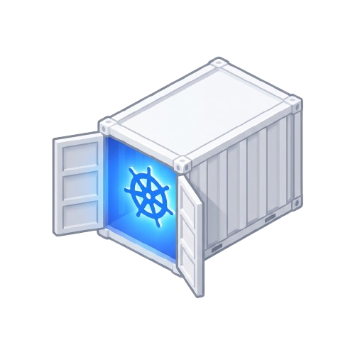
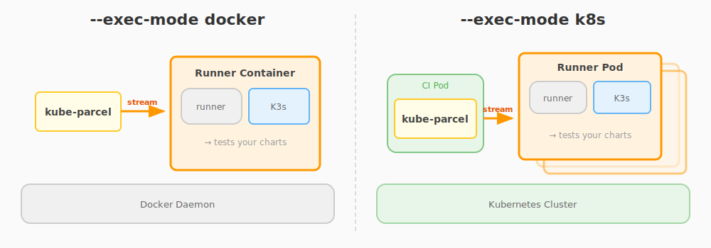

<p align="center">
  
</p>

# kube-parcel

> **Fast, Airgapped Helm Chart Testing — No Registry Required**

**kube-parcel** is an open-source integration testing tool that spins up ephemeral Kubernetes clusters (K3s) and streams your Helm charts + container images directly into them—**without touching a container registry**.

*✨ This project was vibe coded.*

### Why kube-parcel?

- 🚀 **Zero Registry Overhead** — Skip the push/pull cycle. Images stream directly from your CI runner to the test cluster.
- 🔒 **True Airgapped Testing** — Network-isolated K3s clusters ensure your tests don't depend on external services.
- ⚡ **Massive Parallelism** — Spin up hundreds of isolated test environments simultaneously in Kubernetes.
- 🎯 **CI-First Design** — Built for GitHub Actions, GitLab CI, and any Kubernetes-based CI system.

### How It Works

1. **Bundle** your Helm charts and images into a streaming tar archive
2. **Stream** assets directly into a "cold" K3s container (before K3s boots)
3. **Start** the cluster with pre-loaded images—no network pulls needed
4. **Test** with `helm test` and get pass/fail results

---

## ⚡ Quickstart

### Option 1: Pre-built CLI (No Bazel Required)

```bash
# Download the latest release
curl -LO https://github.com/tiborv/kube-parcel/releases/latest/download/kube-parcel-linux-amd64
chmod +x kube-parcel-linux-amd64
sudo mv kube-parcel-linux-amd64 /usr/local/bin/kube-parcel

# Run a test (uses the pre-built runner image from GHCR)
# Note: kube-parcel is AIRGAPPED by default. You MUST bundle all images your chart needs.
kube-parcel start \
  --load-images "nginx:1.25=oci-tar:///path/to/nginx.tar" \
  --load-images "redis:7.0=remote://docker.io/library/redis:7.0" \
  ./my-helm-chart
```

### Option 2: Integrate with Your Bazel Project

To use `kube-parcel` rules directly in your Bazel project:

1. Add the dependency to your `MODULE.bazel`:

```starlark
bazel_dep(name = "kube_parcel", version = "0.0.1")

git_override(
    module_name = "kube_parcel",
    remote = "https://github.com/tiborv/kube-parcel.git",
    commit = "LATEST_COMMIT_SHA",
)
```

2. Define a test target in your `BUILD.bazel`:

```starlark
load("@kube_parcel//bazel:defs.bzl", "kube_parcel_test")

filegroup(
    name = "my_chart",
    srcs = glob(["charts/my-chart/**"]),
)

kube_parcel_test(
    name = "chart_test",
    charts = [":my_chart"],
    # Optional: Pre-load OCI images for airgapped testing
    # images = [":my_image_tarball"],
)
```

3. Run the test:

```bash
bazel test //:chart_test
```

### Docker Mode (Default)

Test locally using Docker:

```bash
kube-parcel start ./my-chart
```

### Kubernetes Mode

Run tests as pods in an existing cluster:

```bash
kube-parcel start --exec-mode k8s --namespace testing ./my-chart
```

For detailed usage and all available flags, see the [Usage Guide](docs/USAGE.md).

## 🚀 Parallel Testing

Each kube-parcel run is **completely isolated**—you can run as many instances as you want without conflicts.

**Local (Docker mode):** Run multiple tests in parallel on your laptop:
```bash
kube-parcel start ./chart-a &
kube-parcel start ./chart-b &
kube-parcel start ./chart-c &
wait
```

**CI (K8s mode):** Scale to hundreds of parallel test pods:
```yaml
# GitHub Actions example
jobs:
  test:
    strategy:
      matrix:
        chart: [frontend, backend, api, worker]
    steps:
      - run: kube-parcel start --exec-mode k8s ./charts/${{ matrix.chart }}
```

Each instance gets a unique name (`kube-parcel-a1b2c3d4`) and runs its own isolated K3s cluster.

---

## 🏗️ Architecture

### Execution Modes

kube-parcel supports two execution modes:



#### 1. Local Mode (`--exec-mode docker`)
Runs on your local Docker daemon. The CLI spawns a runner container, streams assets, and starts the nested cluster.

#### 2. Remote Mode (`--exec-mode k8s`)
Runs inside a Kubernetes cluster. The CLI (running in a CI pod) schedules ephemeral runner pods, allowing massive parallelization.

### State Machine

```
┌──────┐    Upload Stream    ┌─────────────┐    K3s Booting    ┌──────────┐    Helm Install    ┌───────┐
│ IDLE │ ──────────────────> │ TRANSFERRING│ ────────────────> │ STARTING │ ─────────────────> │ READY │
└──────┘                      └─────────────┘                   └──────────┘                    └───────┘
  ⏸️                              �                                �🔥                              ✅
Waiting                       Extracting                       K3s Booting                    Running Tests
                              Assets
```

### Components

**1. Runner (Orchestrator)**
- Runs as PID 1 in `rancher/k3s` container
- **HTTP Server (`:8080`)**: Tar stream uploads, Web UI, Status API
- Routes images → `/var/lib/rancher/k3s/agent/images/`
- Routes charts → `/tmp/parcel/charts/`
- Starts K3s when assets are ready
- Installs Helm charts automatically

**2. Client (CLI)**
- **Multi-launcher**: Start runner locally (Docker) or remotely (K8s `--exec-mode k8s`)

- Supports local tarballs or remote registry pulls via pure-Go libraries
- **HTTP streaming** for tar upload (memory efficient with `io.Pipe`)
- **WebSocket** for real-time log streaming

**3. UI (Vanilla HTML/CSS/JS)**
- Real-time state machine visualization
- WebSocket log streaming (for browser compatibility)
- Collapsible namespace groups in cluster resources
- Helm + Images cards on same row
- Zero build dependencies (embedded in Go binary)

---

## 🚀 Quick Start

### Prerequisites

- Bazel 8.5+ (via bazelisk)
- Docker (for local testing)
- Helm 3 (optional, for chart creation)

### Build

```bash
# Build everything with Bazel
bazel build //...

# Load runner image to Docker
bazel run //cmd/runner:load
```

### Run Example

```bash
# Start runner locally and test sample chart
bazel run //cmd/client -- start examples/sample-chart

# Open browser to see live logs
open http://localhost:38080
```

---

## 📖 Usage

### Command: `start`

Launch runner and upload chart in one command.

```bash
# Local mode (Docker)
bazel run //cmd/client -- start ./my-chart

# Remote mode (Kubernetes)
bazel run //cmd/client -- start --exec-mode k8s --namespace=test-ns ./my-chart

# Additional images
bazel run //cmd/client -- start --load-images "myimage:latest=/path/to/image.tar" ./my-chart
```

### Command: `status`

Check runner status.

```bash
bazel run //cmd/client -- status --server http://localhost:38080
```

### Bazel Integration

kube-parcel can be used as a Bazel module extension, enabling hermetic Helm chart testing in your build.

#### Add to MODULE.bazel

```python
bazel_dep(name = "kube_parcel", version = "0.0.1")

# Optional: configure default settings
kube_parcel = use_extension("@kube_parcel//bazel:extensions.bzl", "kube_parcel")
kube_parcel.options(default_exec_mode = "docker")
```

#### Create Test Targets

```python
load("@kube_parcel//bazel:defs.bzl", "kube_parcel_test")

# Export your chart as a filegroup
filegroup(
    name = "my_chart",
    srcs = glob(["charts/my-app/**"]),
)

# Test with OCI images built by rules_oci
kube_parcel_test(
    name = "my_chart_test",
    charts = [":my_chart"],
    images = ["//images:my_app_tarball"],  # oci_load target
)
```

#### Toggle Exec Mode via .bazelrc

Add to your `.bazelrc`:

```bash
# Docker mode (default) - local Docker daemon
build:docker --define=kube_parcel_exec_mode=docker

# Kubernetes mode - runs as a pod
build:k8s --define=kube_parcel_exec_mode=k8s
```

Then run tests with the desired mode:

```bash
bazel test --config=docker //charts:my_chart_test  # Local Docker
bazel test --config=k8s //charts:my_chart_test     # Kubernetes pod
```

---

## 🔧 How It Works

### 1. Asset Bundling

The client creates a bundled stream containing:
1.  **Helm Chart**: The contents of your chart directory.
2.  **Images**: Any images you explicitly specified via `--load-images` or build rules.

It uses local tar files or pulls directly from registries (via pure-Go libraries) to create the bundle. **No local Docker daemon is required for bundling.**

### 2. Tar-in-Tar Stream

The bundle structure:

```
parcel.tar
├── nginx_1.25.tar          <- Docker image (goes to K3s images dir)
├── redis_7.0.tar           <- Another image
└── charts/
    └── my-chart/
        ├── Chart.yaml
        ├── values.yaml
        └── templates/
            └── deployment.yaml
```

### 3. Runner Processing

```go
// Pseudo-code
for each file in stream {
    if file.endsWith(".tar") {
        extract to /var/lib/rancher/k3s/agent/images/
    } else if file.contains("Chart.yaml") {
        extract to /tmp/parcel/charts/
    }
}

// After extraction
exec("/bin/k3s", "server")
waitForReady()
helm install /tmp/parcel/charts/*
helm test <release>
```

---

## 🎨 UI Features

The embedded web UI provides:

- **State Visualization**: Step timeline (Connect → Extract → K3s → Images → Helm → Test)
- **Live Logs**: WebSocket streaming from K3s/Helm
- **Statistics**: Image count, chart count, uptime, cluster status
- **Cluster Resources**: Collapsible namespace groups with status indicators
- **No Build Required**: Pure HTML/CSS/JS (no npm!)

---

## 🧪 Testing

### Unit Tests

```bash
# Run all unit tests
bazel test //pkg/...

# Run specific tests
bazel test //pkg/runner:runner_test
bazel test //pkg/shared:shared_test
```

### Integration Tests

```bash
# Run K8s mode integration test (requires Docker)
DOCKER_API_VERSION=1.44 bazel run //tests/integration:k8s_mode_test
```

The integration test validates the full chain:
```
Docker → K3s → Runner Pod → Nested K3s → Test Pod
```

---

## � Privileged Container Requirement

kube-parcel requires `--privileged` (or specific capabilities) because:

1. K3s needs to run containerd
2. containerd requires kernel namespaces (`CAP_SYS_ADMIN`)
3. Network setup needs `CAP_NET_ADMIN`

**For Docker:**
```bash
docker run --privileged kube-parcel:latest
```

**For Kubernetes:**
```yaml
spec:
  containers:
  - name: kube-parcel
    securityContext:
      privileged: true
```

---

## 📊 Performance Benefits

| Metric | Traditional | kube-parcel | Improvement |
|--------|------------|-------------|-------------|
| Image availability | Registry pull | Pre-positioned | **100% local** |
| Network latency | 2-10s per image | 0s | **~5-50s saved** |
| Registry auth | Required | Not needed | **Simplified** |
| Test isolation | Shared cluster | Ephemeral K3s | **Complete** |

---

## 🛠️ Development

### Project Structure

```
kube-parcel/
├── cmd/
│   ├── runner/          # Runner (PID 1 in container)
│   │   └── ui/          # Embedded web UI
│   └── client/          # CLI
├── pkg/
│   ├── runner/
│   │   ├── state.go     # State machine
│   │   ├── tar.go       # Tar-in-tar extractor
│   │   ├── k3s.go       # K3s lifecycle
│   │   ├── helm.go      # Helm integration
│   │   └── handler.go   # HTTP handlers
│   ├── client/
│   │   ├── launcher.go  # Multi-launcher (Docker/K8s)
│   │   └── transport.go # HTTP/WebSocket streaming
│   └── shared/
│       └── types.go     # Common types
├── tests/
│   └── integration/     # Integration tests
├── MODULE.bazel         # Bazel dependencies
└── .bazelversion        # Bazel version (8.5.0)
```

### Running Tests

```bash
bazel test //...
```

### Building

```bash
# All targets
bazel build //...

# Load runner image
bazel run //cmd/runner:load

# Run client
bazel run //cmd/client -- start ./my-chart
```


