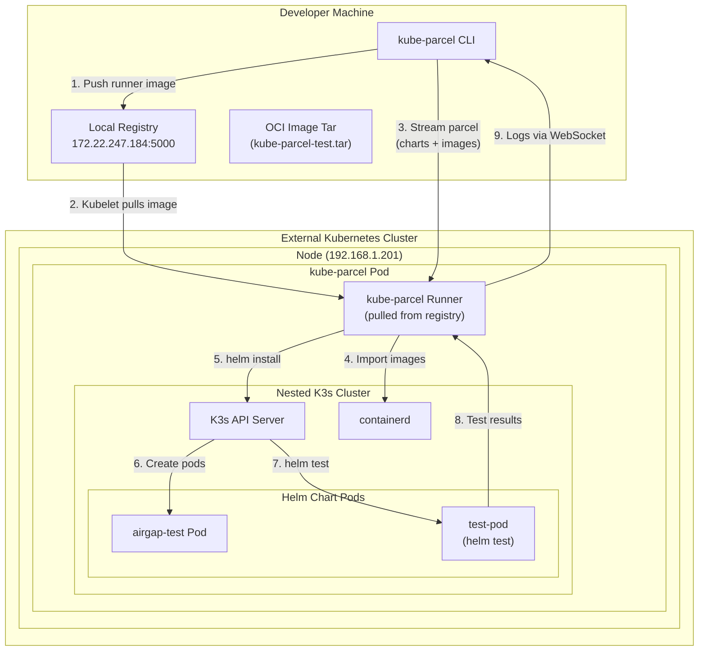

# kube-parcel K8s Mode Architecture

This document explains how `--exec-mode k8s` works.

## Architecture Diagram



## Flow Explanation

### Step 1: Image Preparation
```
Developer Machine → Local Registry (172.22.247.184:5000)
```
The kube-parcel runner image must be pushed to a registry accessible by the K8s cluster nodes.

### Step 2: Pod Creation
```
K8s Cluster → Pulls 172.22.247.184:5000/kube-parcel:latest
```
Kubernetes creates a privileged Pod running the kube-parcel runner image.

### Step 3: Parcel Streaming
```
CLI → HTTP POST → Runner Pod (port-forwarded to 8080)
```
The CLI bundles charts and images into a tar stream and sends it to the runner.

### Step 4: Image Import
```
Runner → containerd (inside nested K3s)
```
Images from the parcel are imported into the nested K3s's containerd.

### Step 5-7: Helm Operations
```
Runner → helm install → K3s → Create Pods → helm test
```
Charts are installed, pods created, and tests executed.

### Step 8-9: Results
```
Test Results → Runner → WebSocket → CLI
```
Test logs and results stream back to the CLI.

## Key Points

| Component | Location | Purpose |
|-----------|----------|---------|
| kube-parcel CLI | Developer Machine | Orchestrates test, bundles assets |
| Local Registry | Developer Machine | Hosts runner image for K8s |
| kube-parcel Pod | K8s Node | Runs K3s + Helm tests |
| K3s | Inside Pod | Nested Kubernetes cluster |
| containerd | Inside K3s | Container runtime for chart pods |

## Why K8s Mode?

- **CI/CD Integration**: Run in existing CI clusters
- **Resource Isolation**: Better resource limits via K8s
- **No Docker Required**: Works without local Docker daemon
- **Scalability**: Run multiple test instances in parallel
